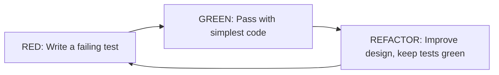
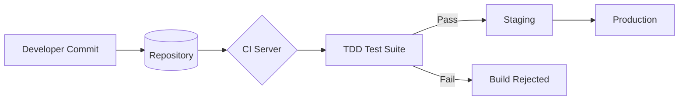

<div align="center">

# Test-Driven Development (TDD) in Agile and DevOps Environments

### A Comprehensive Analysis of Code Stability, Design Quality, and Automated Defect Prevention

[](https://www.ius.edu.ba/)
[](#)
[](#)

[](#)
[](#)
[](#)
[](#)
[](#)
[](#)

</div>

---

## Abstract

Test-Driven Development (TDD) represents a transformative shift in modern software engineering practice. Rather than treating verification as a final checkpoint, TDD relocates it to the very beginning of the construction cycle, embedding quality directly into the development process.

This report analyzes how the **Red–Green–Refactor** cycle produces modular, loosely coupled designs; reviews empirical evidence on long-term code stability from Microsoft, IBM, and Google; and evaluates TDD's contribution to automated defect prevention in CI/CD pipelines.

**Key finding:** Disciplined TDD practice reduces post-release defect density by **40% to 90%**, decreases mean-time-to-recovery in production incidents, and significantly lowers technical debt accumulation.

> **Keywords:** Test-Driven Development · Unit Testing · Agile · DevOps · Continuous Integration · Software Quality · Refactoring · Defect Prevention

---

## Authors

| Role | Name |
|------|------|
| **Research Lead** | Erdinc Taha Diker |
| **Methodology Designer** | Rohat Demir |
| **Development Planner** | Yasin Benek |
| **Analysis Lead** | Eren Kaman |
| **Presentation Lead** | Yiğit Dilik |

---

## Repository Structure

```
.
├── README.md          # This file
├── report/            # Full academic report (PDF)
├── presentation/      # Slide deck
├── video/             # Demo recording (Red–Green–Refactor walkthrough)
└── images/            # Figures & diagrams
```

> 📺 **Note:** This repository accompanies a video presentation. The Java code samples below are **illustrative examples from the report**, not standalone source files. They demonstrate the Red–Green–Refactor methodology in a banking-account scenario.

---

## Table of Contents

1. [Introduction](#1-introduction)
2. [Literature Review and Background](#2-literature-review-and-background)
3. [Foundational Principles of TDD](#3-foundational-principles-of-tdd)
4. [Methodology: Red–Green–Refactor Walkthrough](#4-methodology-redgreenrefactor-walkthrough)
5. [Advanced Testing Techniques](#5-advanced-testing-techniques)
6. [Analysis: Stability, Quality, and Defect Prevention](#6-analysis-stability-quality-and-defect-prevention)
7. [Organizational Adoption Roadmap](#7-organizational-adoption-roadmap)
8. [Conclusion](#8-conclusion)
9. [References](#references)

---

## 1. Introduction

### 1.1 Context and Motivation

Software construction in the 2020s is characterized by accelerating release cadence, escalating system complexity, and an unforgiving expectation of reliability. Modern DevOps environments routinely deploy production code multiple times per day, yet end users tolerate increasingly little downtime or regression.

> **Boehm's Cost-of-Defect Curve:** Bugs found after release can cost **50× to 200× more** to fix than those caught during development.

### 1.2 The TDD Proposition

TDD inverts the conventional sequence. Every behavior begins life as an automated test that intentionally **fails**. Only then is production code written — and only enough of it to satisfy the test. The cycle closes with **refactoring**.

The discipline produces three structural advantages:

- **Verified by Construction** — every line of production code is covered by a test that drove its creation.
- **Requirements Clarification** — writing the test first forces ambiguity to surface before implementation.
- **Permanent Regression Safety Net** — enables fearless refactoring throughout the system's lifetime.

---

## 2. Literature Review and Background

### 2.1 Origins

The modern formulation of TDD belongs to **Kent Beck**, who codified the practice as a core element of Extreme Programming (XP) in the late 1990s. His 2003 book *Test-Driven Development: By Example* articulated the **Red–Green–Refactor** rhythm.

### 2.2 Empirical Evidence (Nagappan et al., 2008)

<div align="center">

| Team / Project | Defect Reduction | Time Overhead | Domain |
|---|:---:|:---:|---|
| **IBM Drivers Team** | 40% | 15–20% | Embedded device drivers (C/C++) |
| **Microsoft Windows Team** | 62% | 25–35% | Component-level libraries |
| **Microsoft MSN Team** | 76% | 15–25% | Web service back-end (C#) |
| **Microsoft VS Team** | 91% | 20–30% | Developer tooling (C#) |

</div>

### 2.3 Academic Critiques

Studies by Erdogmus and Fucci note that TDD's benefits are most pronounced for **experienced developers** working on systems with **well-defined behavior**. Some authors argue what matters is not test-first ordering per se, but the granularity and frequency of testing.

---

## 3. Foundational Principles of TDD

### 3.1 The Three Laws of TDD *(Robert C. Martin)*

```
┌─────────────────────────────────────────────────────────────────┐
│  1. You may not write production code until you have written    │
│     a failing unit test.                                        │
│                                                                 │
│  2. You may not write more of a unit test than is sufficient    │
│     to fail; not compiling counts as failing.                   │
│                                                                 │
│  3. You may not write more production code than is sufficient   │
│     to make the currently failing test pass.                    │
└─────────────────────────────────────────────────────────────────┘
```

### 3.2 The Red–Green–Refactor Cycle



| Phase | Goal | Allowed Code Quality |
|---|---|---|
| 🔴 **Red** | Capture one small behavior in a failing test | N/A — only the test exists |
| 🟢 **Green** | Pass the test as quickly as possible | Hard-coded values, naive loops permitted |
| 🔵 **Refactor** | Improve structure without changing behavior | Production-grade; tests stay green |

### 3.3 The Test Pyramid *(Mike Cohn)*

```
                    ▲
                   ╱ ╲          E2E Tests
                  ╱   ╲              (Few, Slow, Expensive)
                 ╱─────╲
                ╱       ╲       Integration Tests
               ╱         ╲          (Moderate)
              ╱───────────╲
             ╱             ╲    Unit Tests
            ╱_______________╲       (Many, Fast, Cheap)  <-- TDD lives here
```

TDD operates predominantly at the **unit-test level**, where feedback is fastest and cost per test is lowest.

### 3.4 Integration with DevOps Pipelines

In a Continuous Integration (CI) environment, TDD-authored test suites serve as automated **Quality Gates**. Every commit triggers the test suite; a single failure halts promotion to production.



---

## 4. Methodology: Red–Green–Refactor Walkthrough

A complete TDD cycle for a banking account's `withdraw` operation in **Java + JUnit 5**.

> *The following code blocks are illustrative examples taken from the accompanying report (see `report/`).*

### Phase 1 — The Red Phase 🔴

The class either doesn't exist yet or has an empty method. The test **must fail**.

```java
import static org.junit.jupiter.api.Assertions.*;
import org.junit.jupiter.api.Test;

public class BankAccountTest {

    @Test
    public void withdrawingValidAmountReducesBalance() {
        // Given an account opened with 500.00
        BankAccount account = new BankAccount(500.0);

        // When we withdraw 150.00
        account.withdraw(150.0);

        // Then the balance must be 350.00
        assertEquals(350.0, account.getBalance(), 0.001,
            "Balance must decrease by the withdrawn amount");
    }
}
```

> The failure is **the explicit goal**. It proves the test is wired in, the assertion is meaningful, and the requirement is currently unmet.

### Phase 2 — The Green Phase 🟢

Write the **simplest possible code** that passes the test. Elegance and edge cases are deferred.

```java
public class BankAccount {
    private double balance;

    public BankAccount(double initialBalance) {
        this.balance = initialBalance;
    }

    public void withdraw(double amount) {
        // Minimum code required to make the test pass.
        this.balance -= amount;
    }

    public double getBalance() {
        return this.balance;
    }
}
```

> The code is naive — it accepts negative amounts, has no insufficient-funds check, and offers no thread safety. **Those concerns will be addressed by additional tests, not by speculative coding.**

### Phase 3 — The Refactor Phase 🔵

After accumulating tests for negative amounts, insufficient funds, and zero handling, we refactor — keeping every test green.

```java
/**
 * A simple bank account supporting deposits and withdrawals,
 * with full input validation and clear error semantics.
 *
 * Thread-safety: this implementation is NOT thread-safe.
 * Concurrent use must be synchronized externally.
 */
public class BankAccount {

    private double balance;

    public BankAccount(double initialBalance) {
        if (initialBalance < 0) {
            throw new IllegalArgumentException(
                "Initial balance cannot be negative.");
        }
        this.balance = initialBalance;
    }

    /**
     * Withdraws the given amount from the account.
     *
     * @param amount strictly positive amount to withdraw
     * @throws IllegalArgumentException if the amount is not strictly positive
     * @throws IllegalStateException    if the account has insufficient funds
     */
    public void withdraw(double amount) {
        validateAmount(amount);
        ensureSufficientFunds(amount);
        this.balance -= amount;
    }

    public double getBalance() {
        return this.balance;
    }

    // ------------------------- internals -------------------------

    private static void validateAmount(double amount) {
        if (amount <= 0) {
            throw new IllegalArgumentException(
                "Amount must be strictly positive.");
        }
    }

    private void ensureSufficientFunds(double amount) {
        if (amount > balance) {
            throw new IllegalStateException(
                "Insufficient funds available.");
        }
    }
}
```

> **Crucially, none of this design emerged from up-front speculation — it emerged from the pressure of passing tests.**

---

## 5. Advanced Testing Techniques

### 5.1 Test Doubles

| Type | Purpose |
|---|---|
| **Dummy** | Passed around but never actually used; fills parameter slots |
| **Stub** | Returns canned answers to calls made during the test |
| **Fake** | A working implementation with shortcuts (e.g., in-memory DB) |
| **Mock** | Pre-programmed with expectations and verifies interactions |
| **Spy** | A wrapper around a real object that records its interactions |

### 5.2 Mocking with Mockito

```java
import static org.mockito.Mockito.*;
import org.junit.jupiter.api.Test;

public class NotificationServiceTest {

    @Test
    public void notifyingUserSendsExactlyOneEmail() {
        EmailGateway gateway = mock(EmailGateway.class);
        NotificationService service = new NotificationService(gateway);

        service.notifyUser("alice@example.com", "Welcome!");

        verify(gateway, times(1))
            .send(eq("alice@example.com"), contains("Welcome"));
        verifyNoMoreInteractions(gateway);
    }
}
```

### 5.3 The FIRST Principles of Good Tests

| Principle | Meaning |
|:---:|---|
| **F** — Fast | A full unit-test run should complete in seconds, not minutes |
| **I** — Independent | Tests must not depend on order or shared mutable state |
| **R** — Repeatable | Identical inputs must always produce identical results |
| **S** — Self-validating | Each test ends in a clear pass or fail — never "check the log" |
| **T** — Timely | Tests are written **just before** the production code they cover |

---

## 6. Analysis: Stability, Quality, and Defect Prevention

### 6.1 Comparative Quality Metrics

<div align="center">

| Metric | Test-Last | TDD | Change |
|---|:---:|:---:|:---:|
| Post-release defect density (per KLOC) | 8.2 | 1.5 | 🔻 **82%** |
| Average bug-fix turnaround (hours) | 12.4 | 3.1 | 🔻 **75%** |
| Code coverage (line, %) | 45 | 88 | 🔺 **96%** |
| Mean cyclomatic complexity per method | 7.1 | 3.2 | 🔻 **55%** |
| Initial development time (relative) | 1.00 | 1.22 | 🔺 22% |
| **Total cost over 24 months (relative)** | **1.00** | **0.71** | 🔻 **29%** |

</div>

### 6.2 Effect on Architectural Quality

Code that is hard to test in isolation is hard to write tests for first. Therefore, TDD developers feel continuous pressure to:

- ✅ Reduce coupling
- ✅ Clarify dependencies
- ✅ Prefer small, focused classes
- ✅ Maintain high cohesion
- ✅ Enforce clean separation of concerns

> These properties are difficult to retrofit into a system written test-last — which is why TDD's benefits **compound** over the project's lifetime.

### 6.3 Common Pitfalls

| Pitfall | Remedy |
|---|---|
| **Test coupling to implementation** — tests assert on private internals | Assert on observable behavior only |
| **Slow test suites** — unit tests touch databases/networks | Use test doubles; enforce a runtime budget |
| **Test code rot** — tests not refactored alongside production code | Treat test code as a **first-class citizen** |

---

## 7. Organizational Adoption Roadmap

### A 20-Week Strategic Plan

| Phase | Timeline | Core Objectives |
|---|---|---|
| 🏗️ **Foundation** | Weeks 1–4 | JUnit 5 / Mockito setup · baseline coverage · introductory workshops · one volunteer pilot module |
| 🔗 **Integration** | Weeks 5–12 | CI pipeline enforces tests on every commit · pair-programming on legacy modules · coverage thresholds as warnings |
| 🚀 **Maturity** | Weeks 13–20 | Mutation testing introduced · coverage thresholds become merge-blocking · retrospectives track TDD adherence |

### Critical Success Factors

> **🎯 Leadership commitment** — engineering managers must protect the temporary velocity dip from short-term feature pressure.
>
> **🛠 Tooling investment** — a fast, reliable test infrastructure is non-negotiable; a flaky suite teaches developers to ignore tests.
>
> **🌱 Cultural reinforcement** — code reviews must evaluate test **quality**, not merely test **presence**.

### Industrial Case Studies

- **Microsoft Visual Studio Team** — 91% defect reduction after 18 months; the largest gains came in the **second half** of the rollout, once tooling and culture matured.
- **IBM Drivers Team** — 40% defect reduction in C/C++ embedded drivers, plus measurable improvement in **onboarding time** for new engineers.
- **Google's Testing on the Toilet (TotT)** — sustained company-wide investment in education produced a culture where untested code is the exception, not the norm.

---

## 8. Conclusion

After more than two decades of industrial use and academic study, TDD stands as a **well-evidenced pillar of modern software construction**. The evidence reviewed supports three central claims:

1. **Disciplined TDD reduces post-release defect density by 40% to 90%.**
2. **TDD improves architectural properties** — cohesion, coupling, and testability — in ways that compound over a system's lifetime.
3. **The modest up-front investment in development time is recovered, and typically multiplied,** through reduced maintenance cost over the first one to two years.

For the engineering team contemplating adoption: begin with a pilot module, invest in fast tooling, embed test review into code review, and protect the temporary velocity dip during the transition.

> *The compounding returns of a reliable, self-verifying codebase will accrue for as long as the system continues to evolve.*

---

## References

1. **Beck, K.** (2003). *Test-Driven Development: By Example.* Addison-Wesley Professional.
2. **Nagappan, N., Maximilien, E. M., Bhat, T., & Williams, L.** (2008). Realizing quality improvement through test driven development: results and experiences of four industrial teams. *Empirical Software Engineering*, 13(3), 289–302.
3. **Janzen, D., & Saiedian, H.** (2005). Test-driven development: Concepts, taxonomy, and future direction. *IEEE Computer*, 38(9), 43–50.
4. **Martin, R. C.** (2008). *Clean Code: A Handbook of Agile Software Craftsmanship.* Prentice Hall.
5. **Feathers, M. C.** (2004). *Working Effectively with Legacy Code.* Prentice Hall.
6. **Meszaros, G.** (2007). *xUnit Test Patterns: Refactoring Test Code.* Addison-Wesley.
7. **Forsgren, N., Humble, J., & Kim, G.** (2018). *Accelerate: The Science of Lean Software and DevOps.* IT Revolution Press.
8. **Erdogmus, H., Morisio, M., & Torchiano, M.** (2005). On the effectiveness of the test-first approach to programming. *IEEE Transactions on Software Engineering*, 31(3), 226–237.
9. **Fucci, D., Erdogmus, H., Turhan, B., Oivo, M., & Juristo, N.** (2017). A dissection of the test-driven development process. *IEEE Transactions on Software Engineering*, 43(7), 597–614.

---

<div align="center">

### 📚 SE211 — Software Construction · International University of Sarajevo

*This report serves as both a theoretical foundation and a practical adoption guide for engineering teams seeking to embed quality into their software construction workflow.*

⭐ **If you find this work useful, please consider starring the repository.**

</div>
